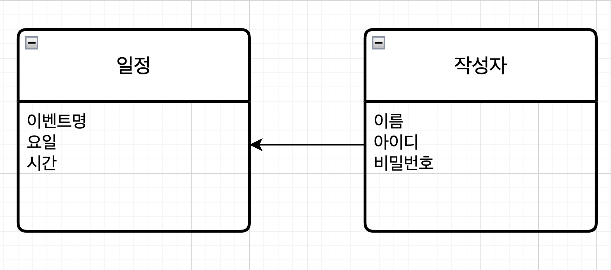

#일정관리

##작성자 API 설계하기

|:기능:|:Method:|:URL:|:request:|:response:|:상태코드:|
|:순서추가:|:POST:|/api/athor|요청 body|추가정보|200:정상추가|
|:작성자조회:|:GET:|/api/athor{athors}|요청 param|단건응답정보|200:정상조회|
|:아이디조회:|:GET:|/api/athor{athors}|요청 param|단건응답정보|200:정상조회|
|:비밀번호조회:|:GET:|/api/athor{athors}|요청 param|단건응답정보|200:정상조회|

##일정관리 API 설계하기

|:기능:|:Method:|:URL:|:request:|:response:|:상태코드:|
|:일정추가:|:POST:|/api/daily|요청 body|추가정보|200:정상추가|
|:일정조회:|:GET:|/api/daily/{dailies}|요청 param|단건응답정보|200:정상조회|
|:일정목록조회:|:GET:|/api/daily|요청 param|다건응답정보|200:정상조회|
|:일정수정:|:PUT:|/api/daily{dailies}|요청 body|수정정보|200:정상수정|
|:일정삭제:|:DELETE:|/api/daily{dailies}|요청 param|200:정상삭제|

===============================

